# LinkSense

[English](./README.md) | 简体中文

**面向组织的开源 AI 工作空间。**

每位员工都拥有完整的 AI 工作空间。他们构建的技能、知识和集成，会成为整个组织可共享、可治理、可复用的能力。

[在线体验](https://explore.linksense.org/) · [快速开始](#快速开始) · [工作方式](#组织能力) · [系统架构](#系统架构) · [基于 LinkSense 扩展](#基于-linksense-扩展)

<p align="center">
  
</p>

<p align="center"><em>面向组织的开源 WorkBuddy 替代方案。</em></p>

---

## 为什么选择 LinkSense

### 让每个人都能用 AI 完成实际工作

为每位用户提供功能完整的智能体工作空间，完成调研、浏览、代码、数据和文档等实际工作，而不是功能受限的企业聊天机器人。

### 形成组织能力，而非各自独立的个人配置

有效的技能、组织知识、系统连接和经过实践的 AI 配置，可以成为整个组织共享、治理和复用的能力，而不再局限于某个人的账号。

### 开源，并由你掌控

在自己的基础设施上部署。自主选择模型与集成服务，查看并修改源码，无需依赖 LinkSense 云端控制平面即可运行。

---

## 快速开始

同一仓库提供两种部署方案：

**Core** — AI 工作空间 + 组织能力平台
**Full** — Core + 完整的文档处理与知识检索

Core 需要 4+ vCPU、8+ GiB 内存和 60+ GiB 可用 SSD 空间。Full 需要 8+ vCPU、16+ GiB 内存和 120+ GiB 可用 SSD 空间。要求 Docker Engine API v1.45+ 和 Docker Compose v2.24.4+。
完整要求见[部署参考](#部署参考)。

### Linux

```bash
# Core
curl -fsSL https://raw.githubusercontent.com/LingX-AI/linksense/main/install-core.sh | sudo sh

# Full
curl -fsSL https://raw.githubusercontent.com/LingX-AI/linksense/main/install-full.sh | sudo sh
```

然后打开 `http://<server-address>:18081`。

### macOS

```bash
# Core
curl -fsSL https://raw.githubusercontent.com/LingX-AI/linksense/main/install-core.sh | sh

# Full
curl -fsSL https://raw.githubusercontent.com/LingX-AI/linksense/main/install-full.sh | sh
```

然后打开 `http://localhost:18081`。

### 希望先阅读脚本

```bash
curl -fsSL -o install-core.sh https://raw.githubusercontent.com/LingX-AI/linksense/main/install-core.sh
less install-core.sh
sudo sh install-core.sh
```

安装器会在写入持久化状态前检查主机，自动生成运行时密钥，并输出一次性初始化凭据，用于创建首位管理员。

Linux 将部署文件保存在 `/opt/linksense`，macOS 使用 `~/.linksense`。

本地启动不强制要求域名和 HTTPS。公开部署应在 `18081` 端口前配置 HTTPS 反向代理。

### 还没准备好安装？

发起一条[讨论](../../discussions)，告诉我们你希望完成什么，我们会阅读每一条。如果你正在为组织评估 LinkSense，我们正在与少量早期设计合作伙伴协作，并会帮助你部署：`hello@linksense.org`。

已经在使用 LinkSense？欢迎将你的组织添加到 [ADOPTERS.md](./ADOPTERS.md)。

---

## 看看 LinkSense 如何工作

### 完成实际工作

<p align="center">
  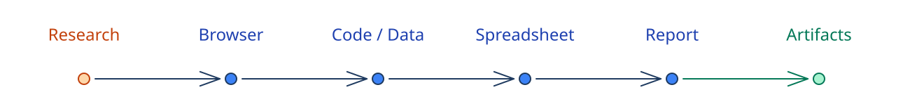
</p>

### 个人技能 → 组织能力

<p align="center">
  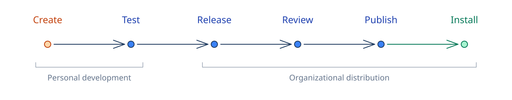
</p>

### 能力 → 团队应用

<p align="center">
  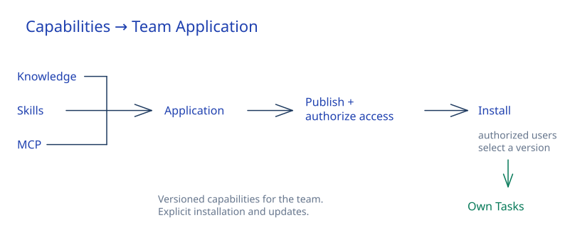
</p>

---

## 组织能力

LinkSense 为每位用户提供自己的 AI 工作空间，同时提供组织层面的能力管理，让个人构建的成果转化为跨团队共享、治理和复用的能力。

| 能力对象 | 在组织中的作用 |
| --- | --- |
| **知识库** | 在访问控制下，为 AI 提供组织上下文 |
| **技能（Skills）** | 将有效的工作方法转化为可复用的能力 |
| **MCP 服务** | 将 AI 连接到组织的系统与操作 |
| **插件（Plugins）** | 将技能和 MCP 集成打包，经审核后分发 |

这些能力可以从个人实践起步，逐步成为整个组织可复用的能力。

<p align="center">
  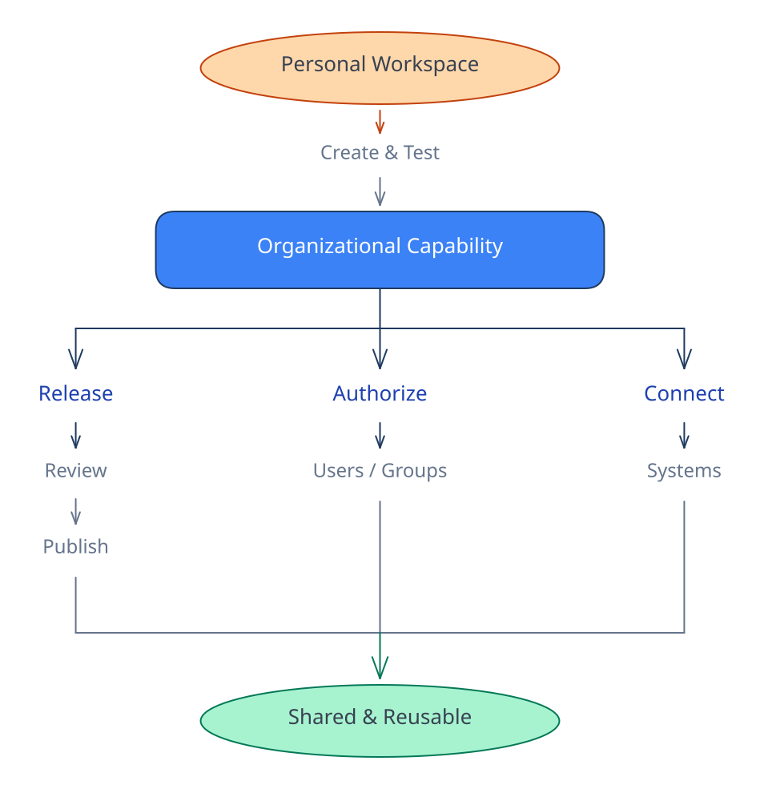
</p>

技能和插件可以从个人开发开始，经过不可变版本发布、管理员审核、组织发布、安装和显式更新。

知识库可以授权给指定用户和用户组。MCP 连接与凭据保持独立管理，让 AI 能力可以连接组织系统，而不必将底层凭据分发给每位用户。

**委托执行，而非共享凭据。**

### 应用 — 将能力转化为他人可用的体验

应用是这些能力汇集的地方。

应用将持续维护的指令与模型配置，同组织知识、技能、插件和 MCP 连接组合起来，再将这种体验提供给获得授权的用户和用户组。

<p align="center">
  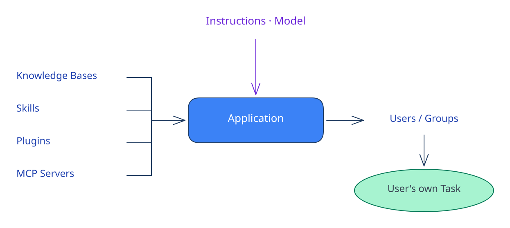
</p>

例如：

<p align="center">
  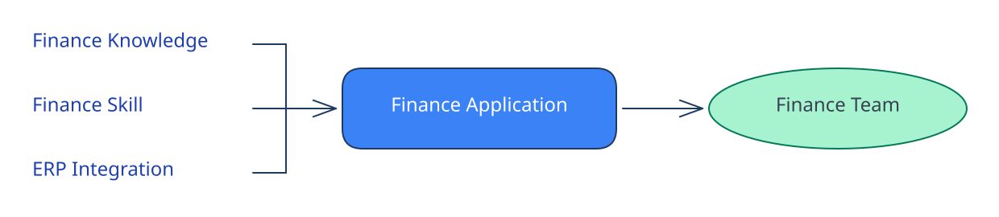
</p>

用户无需自行重新搭建底层配置。他们打开获得授权的应用，即可发起自己的任务，所需能力已经按该使用场景组合并维护好。

应用**不是自主智能体**，而是可复用的 AI 工作入口。每位获得授权的用户发起并拥有自己的任务，应用则提供背后持续维护的配置和组织能力。

应用还可以提供对创建者维护的知识和 MCP 能力的受控访问，而不必授予用户直接管理权限，也不会通过 LinkSense 的常规界面暴露底层凭据。

围绕这些能力，LinkSense 提供身份、归属、用户 / 用户组授权、发布与审核、凭据管理、模型管理、用量、审计和运行维护。

它们共同构成了**连接前沿 AI 与组织的开放能力层。**

<p align="center">
  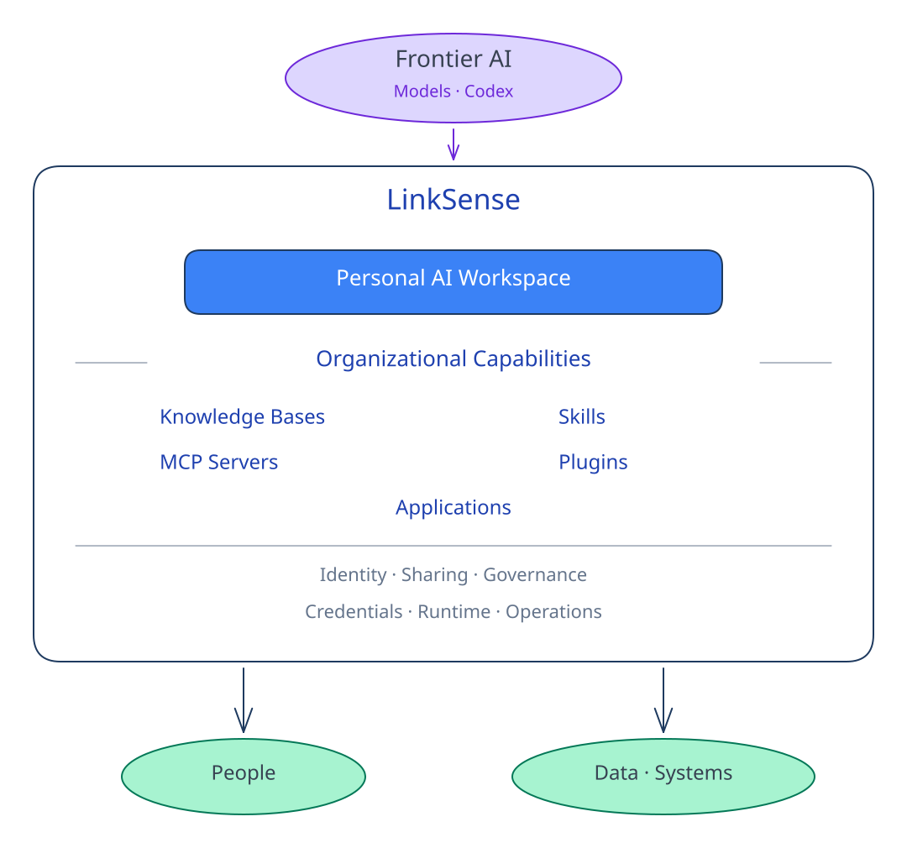
</p>

---

## 基于开源 Codex 运行时

LinkSense 在自己管理的 Worker 中运行开源 Codex 运行时，无需依赖 Codex 网页应用或由 LinkSense 托管的 Codex 服务。

LinkSense 通过以下方式直接运行官方 `@openai/codex` 包：

```bash
codex app-server --stdio
```

并通过 Codex app-server JSON-RPC 协议与其通信。

Codex 运行时在 LinkSense 部署环境内执行。模型推理单独配置：组织可以接入自行选择的模型提供商或兼容的私有服务端点。

LinkSense **不**分叉 Codex、不修改其源码，也不重新实现智能体循环。

| Codex | LinkSense |
| --- | --- |
| 智能体推理与轮次（Turns） | 组织工作空间 |
| 原生工具与执行 | 身份、共享和治理 |
| 技能与插件 | 发布与组织生命周期 |
| 模型与子智能体 | 应用、知识和 MCP 管理 |
| 沙箱语义 | Worker、持久化、用量和运维 |

> **Codex 决定智能体如何执行。LinkSense 决定它能访问什么、在哪里运行、能力如何共享和治理，以及执行如何持久化和运维。**

Codex 运行时由 OpenAI 以 Apache-2.0 许可发布，并以未修改的形式随项目交付；其 `NOTICE` 文件包含在我们的镜像中。参阅 [THIRD-PARTY-NOTICES.md](./THIRD-PARTY-NOTICES.md)。

*Codex 是 OpenAI 的商标。LinkSense 是独立项目，与 OpenAI 无关联，也未获得 OpenAI 的赞助或认可。*

---

## 开源。自主部署。由你掌控。

组织能力层本身就是开源的。应用、技能和插件、MCP 管理、知识、身份与用户组、治理、凭据、用量与审计、Runner、Worker，以及 Core 和 Full 部署方案，都属于开源项目。

组织功能并未被拆分到必须依赖的闭源企业运行时或 LinkSense 运营的云端控制平面中。

在自己的服务器、私有云或 VPC 中运行完整平台。查看源码、修改平台、自主选择模型与集成服务，并在自己掌控的基础设施中运行。没有强制的在线运行时许可激活心跳。

使用私有模型、本地知识和本地 MCP 服务时，提示词、文件、任务状态、知识索引、凭据、审计记录和结果都可以保留在你掌控的基础设施中。

配置的外部服务仍可能产生外部网络请求，因此 LinkSense 将自己描述为**支持自主部署、适合私有网络**，而非正式的完全离线隔离系统。

**模型：** OpenAI · Azure OpenAI · Anthropic · Google / Vertex · Alibaba · DeepSeek · OpenRouter · OpenAI 兼容端点

### LinkSense 希望你保留什么

只有一项：一行小型署名，由 `Powered by` 和我们的标志组成，高度为 18–24px。当前界面实现会链接到我们的网站，但许可证本身不要求 URL，也不要求显示版权行。它位于界面底部的一个固定区域，并在用户切换页面时保持显示，因此每个页面不必各自重复放置。[具体样式见这里](./ATTRIBUTION.md)。

以下**无需展示**的情况已写入许可证，无需自行解释：

| | |
|---|---|
| 对话框、菜单、工具提示 | 不重复展示，底层页面已经包含署名 |
| 全屏编辑、预览、演示 | 可以隐藏，退出后恢复即可 |
| **用户导出的文档、演示文稿和图片** | **不要求任何形式的水印，始终如此** |
| 命令行、无界面服务、仅 API | 不承担展示义务 |

任何规模的内部部署，无论是否修改，都**不会产生公开任何内容的义务**，参阅[内部部署例外](./LICENSE-EXCEPTIONS.md)。

可以使用自己的品牌，无需另行许可：产品名称、标志、颜色和文案均可自行调整。你的名称在顶部，我们的署名在底部。如需完全移除署名，可洽谈商业许可：`licensing@linksense.org`。

---

## 系统架构

<p align="center">
  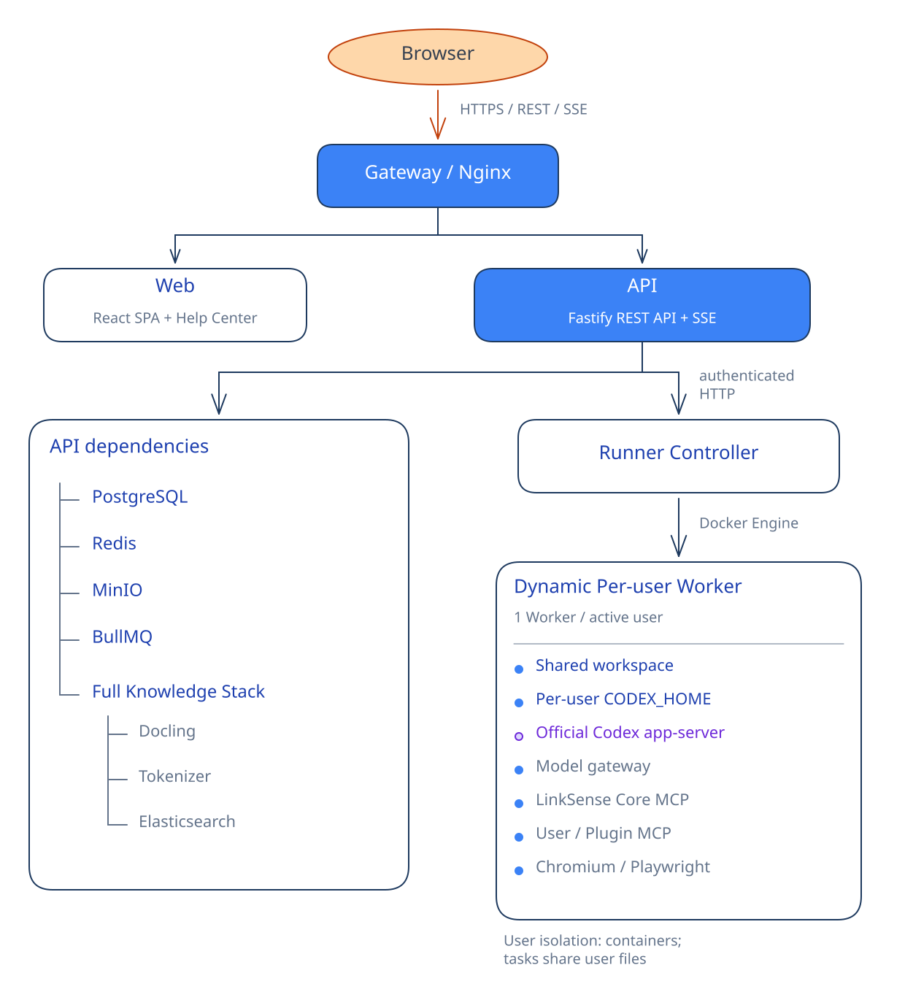
</p>

### Worker 模型

LinkSense 为每位活跃用户动态管理一个 Docker Worker。

同一用户的多个任务可以复用该 Worker。每个任务都拥有独立的工作目录和 `CODEX_HOME`。

任务工作目录是相互隔离的目录，**不是独立的容器或内核边界**。

闲置 Worker 会被回收。每用户的软件包环境可以在回收后保留，生成的交付成果则独立持久化到对象存储中。

Worker 控制包括可配置的 CPU / 内存 / PID 限制、只读根文件系统、`no-new-privileges`、移除 Linux capabilities、非特权容器、以非 root 身份运行任务进程，以及独立的控制网络和出站网络。

Worker 不直接加入 PostgreSQL 或 Redis 的服务网络。目前允许互联网出站访问；LinkSense 不强制执行通用域名白名单或默认拒绝全部出站流量的策略。

### 执行路径

实时任务通常沿以下路径执行：

<p align="center">
  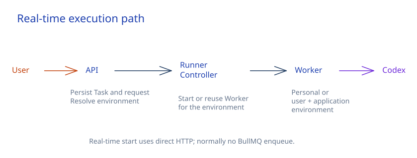
</p>

执行前通常不会先进入 BullMQ。

BullMQ 主要处理自动化、定时与后台任务、Worker 维护、恢复、邮件、计费、知识同步与处理，以及清理工作。

### 事件传递

<p align="center">
  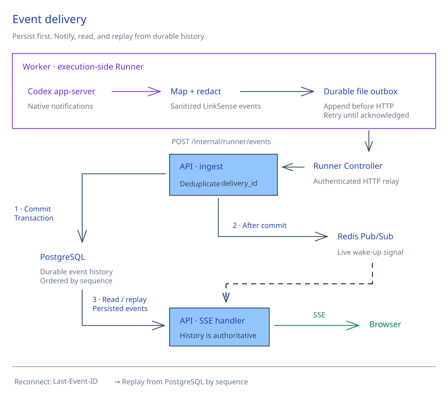
</p>

---

## 基于 LinkSense 扩展

LinkSense 提供三种主要扩展方式，无需修改 LinkSense 源码。

### 构建技能

使用原生 Codex 技能格式，将可复用的方法、工作流、领域实践、脚本、参考资料和辅助资源交给 AI。

<p align="center">
  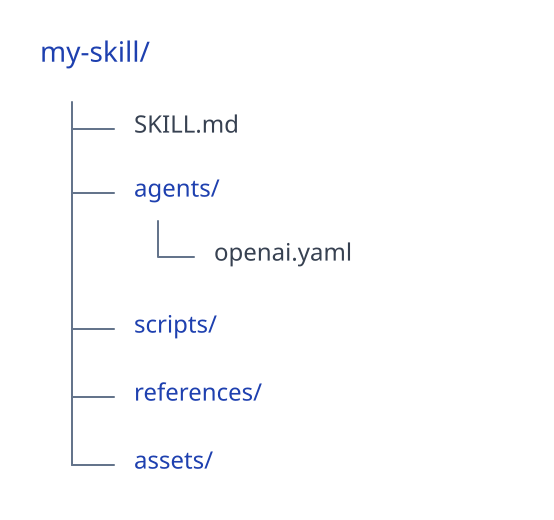
</p>

技能既可以由 Codex 原生发现，也可以由用户和应用显式选择。

### 构建基于 MCP 的插件

通过 MCP 连接外部系统与 API，再将 MCP 声明、技能和辅助资源一起打包。

<p align="center">
  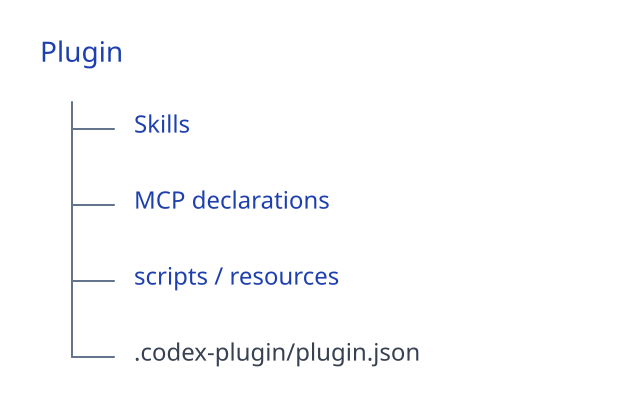
</p>

对于 CRM、ERP、SaaS、监控系统和内部 API，通常推荐将 MCP 作为集成边界。

凭据与插件包保持分离。

### 构建交互式应用

基于已授权的 LinkSense 能力，构建面向特定用途的界面和工作流。

交互式应用包含 `manifest.json`、HTML、JavaScript、CSS 和资源文件，并在沙箱化的 iframe 中运行。

其 SDK 可以请求明确获准的能力，例如访问用户资料、发现能力、访问知识库、发现 MCP 服务，以及创建任务。

交互式应用与普通应用相互独立，普通应用主要是配置和能力组合对象。

---

## 部署参考

### 环境要求

| 方案 | CPU | 内存 | 可用 SSD 空间 |
| --- | ---: | ---: | ---: |
| Core | 4+ vCPU | 8+ GiB | 60+ GiB |
| Full | 8+ vCPU | 16+ GiB | 120+ GiB |

- Linux：x86_64 或 ARM64 架构上的 Ubuntu、Debian、Fedora、RHEL、Rocky Linux、AlmaLinux 或 CentOS
- macOS：配备 Docker Desktop 的 Intel 或 Apple Silicon 设备
- 发行镜像支持 `linux/amd64` 和 `linux/arm64`
- Docker Engine API v1.45+
- Docker Compose v2.24.4+
- `curl`
- 默认 TCP 端口 `18081` 可用

### 自定义端口

```bash
curl -fsSL https://raw.githubusercontent.com/LingX-AI/linksense/main/install-full.sh \
  | sudo env LINKSENSE_HTTP_PORT=19090 sh
```

### 命令行管理

```bash
linksense status
linksense start
linksense stop
linksense restart
linksense port 19090
linksense credential
linksense logs api
linksense doctor
linksense repair
linksense upgrade v0.3.0
```

不带参数运行 `linksense`，可打开交互式管理菜单。

Linux 会在需要时请求 `sudo`。macOS 请将 `$HOME/.local/bin` 加入 `PATH`，并在不使用 `sudo` 的情况下执行命令。

### 修复与升级

```bash
# Linux
curl -fsSL https://raw.githubusercontent.com/LingX-AI/linksense/main/repair-core.sh | sudo sh
curl -fsSL https://raw.githubusercontent.com/LingX-AI/linksense/main/repair-full.sh | sudo sh
curl -fsSL https://raw.githubusercontent.com/LingX-AI/linksense/main/upgrade.sh | sudo sh
```

macOS 使用相同命令，但不加 `sudo`。

修复沿用已安装的发行版本。升级会识别 Core / Full，等待正在运行的工作结束，并在迁移前将经过校验的 PostgreSQL 备份保存到 `volume://linksense-backups/postgres/`。

不会删除数据卷。迁移开始后若发生失败，不会自动回滚数据库；请保留输出的备份位置，查看诊断信息后重新执行升级。

---

## 技术栈

| 层 | 技术 |
| --- | --- |
| Web | React 19 · TypeScript · Vite · React Router · TanStack Query · shadcn/ui · Base UI · Tailwind · i18next |
| API | Node.js · TypeScript · Fastify 5 · Zod · Prisma · PostgreSQL · Redis · BullMQ · MinIO |
| Runner | Node.js · TypeScript · Fastify · Docker · 官方 Codex app-server · Chromium / Playwright |
| 知识 | Docling · Elasticsearch · BM25 + 向量检索 · RRF · 可选重排序 |

第三方组件保留各自的许可证，具体版本记录在 [THIRD-PARTY-NOTICES.md](./THIRD-PARTY-NOTICES.md) 中。

---

## 本地开发

需要 Node.js 24+、pnpm 10.6.4、Docker Engine / Compose 和 rsync。

应用及其依赖在 Linux 容器中运行，宿主机上的 rsync 仅用于同步源码。

```bash
corepack enable
corepack prepare pnpm@10.6.4 --activate
pnpm install --frozen-lockfile
pnpm dev:prepare
pnpm dev
```

默认地址：

- Web：`http://localhost:18172`
- Web HTTPS：`https://localhost:18173`
- API：`http://localhost:4000`
- Runner：`http://localhost:4010`

常用命令：

```bash
pnpm dev:stop
pnpm dev:rebuild
pnpm dev:worker:rebuild
pnpm test
pnpm typecheck
pnpm lint
pnpm build
```

`pnpm dev:prepare` 会构建应用镜像、生产任务 Worker 和双语帮助中心，检查基础设施与数据库初始化，启动服务，并预热运行时缓存。

`pnpm dev` 会自动准备缺失的输入。

### AI 开发指南

使用 Codex 或其他 AI 编程工具前，请阅读 [`AGENTS.md`](./AGENTS.md)。

AI 生成的功能和行为变更与其他贡献一样，需要配套测试。提交前请运行受影响的测试、类型检查、lint 和构建。

不要提交密钥、个人数据、内部需求文档或生成产物。

---

## 使用 Docker 从源码构建

```bash
docker compose --env-file .env.example build \
  migrate api runner runner-worker-image web
```

多平台构建：

```bash
docker buildx build --platform linux/amd64,linux/arm64 --target runtime \
  -f Dockerfile.api -t <registry>/linksense-api:<tag> --push .
```

| 文件 | 构建目标 | 产物 |
| --- | --- | --- |
| `Dockerfile.api` | `runtime` / `migration` | API / 数据库迁移 |
| `Dockerfile.web` | `runtime` | Web + 帮助中心 |
| `Dockerfile.runner` | `controller` / `worker` | Runner 控制器 / 任务 Worker |

接近生产环境的本地运行方案：

```bash
pnpm dev:prod
pnpm dev:prod:stop
```

生产环境优先使用经过验证、以不可变摘要固定的发行镜像，而不是直接在生产主机上构建源码。

---

## 安全

参阅 [SECURITY.md](./SECURITY.md)。

安全问题报告：`security@linksense.org`

## 贡献

参阅 [CONTRIBUTING.md](./CONTRIBUTING.md) 和 [`AGENTS.md`](./AGENTS.md)。

贡献代码需要签署[贡献者许可协议](./CLA.md)。CONTRIBUTING.md 解释了具体原因，以及我们相应作出的承诺。

## 谁在使用 LinkSense

如果你的组织在使用 LinkSense，我们很希望了解，欢迎在 [ADOPTERS.md](./ADOPTERS.md) 中添加一行。登记完全自愿，我们不会擅自添加任何组织。不希望公开？请联系 `hello@linksense.org`。

## 获取支持

参阅 [SUPPORT.md](./SUPPORT.md)。

## 开源协议

LinkSense 采用 [CPAL-1.0](./LICENSE) 开源，这是一项[经 OSI 批准](https://opensource.org/licenses)的许可证，在 Mozilla Public License 1.1 基础上加入了小型署名要求和网络使用条款。

**任何规模的内部运行，无论是否修改，都没有公开任何内容的义务。**[内部部署例外](./LICENSE-EXCEPTIONS.md)对此作出了明确规定。在你自己文件中编写的专有插件和扩展仍归你所有；CPAL 的 copyleft 以文件为单位，不会延伸到你的代码。

**两项义务，触发方式各不相同**，这也是最容易被混淆的部分：

| | 触发条件 | 内部部署 |
|---|---|---|
| 公开你的修改 | 再分发，或向第三方提供服务 | **否** |
| 展示署名 | 通过图形界面启动 | **是** |

因此，组织在自己的网络中运行 LinkSense，不承担源码公开义务，只需保留一行署名。
[具体样式见这里](./ATTRIBUTION.md)。

**商标单独授权。**你可以分叉、重命名、分发，甚至与我们竞争，只是不要将其命名为 LinkSense。参阅 [TRADEMARK.md](./TRADEMARK.md)。

**不追溯收紧条款。**以 CPAL-1.0 发布的每个版本都将永久保留 CPAL-1.0 许可。我们不会追溯收紧条款，这项承诺已[明确写入附加许可](./LICENSE-EXCEPTIONS.md)。

**以你自己的品牌部署。**重命名、调整样式、在顶部放置自己的标志，都无需另行许可。保留的只是一行署名。如果也需要移除署名，或需要其他许可条款，请联系 `licensing@linksense.org`。

第三方组件保留各自的许可证，参阅 [THIRD-PARTY-NOTICES.md](./THIRD-PARTY-NOTICES.md)。
