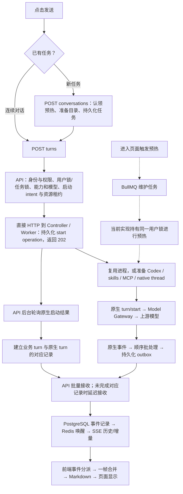

**任务启动、首字与连续对话延迟：源码审计和优化方案**

审计日期：2026-09-17。基线：develop / b99d615，包含检查时的工作区状态。问题覆盖本地与已部署环境。本次完成源码、提交历史、实际本地 Worker 协议、现有测试和本地运行记录分析；未修改业务实现、配置、数据库结构或部署。

工作区存在正在进行的维护设置、用户环境等修改，检查期间仍有变化。本报告不把这些未提交改动视为已经部署，也不替换它们。源码行号对应本次检查快照。

**1. 结论与证据强度**

目前存在能够造成明显内部等待的具体路径，不能把慢统一归因于模型接口。

| 优先级 | 发现 | 证据及影响 |
| --- | --- | --- |
| P1 | 后台预热持有前台也必须获得的用户生命周期锁 | 9 月 16 日 6621def 新增。整个用户 HOME、能力解析、Runner 预热都在锁内；同用户创建任务、提交下一轮会竞争这把锁。本地实际 Worker 预热有秒级样本，具备直接拖慢前台的条件。已确认代码机制，尚未捕获同一次点击的锁等待 trace。 |
| P1 | 正常启动结果依赖 250 / 500 / 1000 ms 轮询，早到事件又遇到指数退避 | 前端拿到 202 后，API 要等原生 turn 与业务 turn 的对应记录建立；此前 Runner 事件不能被接收。两段等待可能叠加，尤其影响 1 秒连续对话目标。部分时间与模型等待重叠，不能机械相加。 |
| P1 | 项目新任务的预热与最终工作区可能不匹配 | 新任务预热请求只有任务 ID / 模式，缺 project_id；创建任务时才确定项目路径。Runner 指纹包含工作区，预热命中后仍可能在首轮重建进程。不是所有新任务都会触发。 |
| P1 | 现有性能验收没有约束真实首字 | first_text_ms 被记录但不参与 evaluateLatencyTargets；创建任务时间没有纳入首轮计时。现有脚本成功不能证明 3 秒 / 1 秒达标。 |
| P2 | 热路径重复解析和重复数据库访问 | 能力 / MCP 状态在预检与启动屏障重复解析；插件凭据按插件逐个 await；RunnerClient 多数会话请求再查询一次 workspaceRelPath。调用机制已确认，收益需分段计时。 |
| P2 | 预热就绪和失效管理不完整 | 前端把入队 receipt 当作 completed；60 秒只是调用节流，没有定时保活；项目、模型等未纳入新任务预热 scope。默认进程与 Worker 空闲 TTL 都为 15 分钟。 |
| P2 | 能力版本变化和冷启动会重新触发较重准备 | 内置能力 revision 变化会使快照与进程指纹变化；9 月 17 日有此类修改。属于条件性失效，不能解释所有稳定热对话。 |
| P2 | 长输出仍需要页面与磁盘的持续吞吐实测 | 前端有整段 Markdown 预处理和逐事件 sessionStorage 写入，Runner 有可靠落盘；它们是待量化优化点，尚不能认定为本次主要回归。 |

最先落地的组合应是：**补齐计时与验收 → 消除预热对前台的长锁阻塞 → 启动结果及时建立业务关联 → 修正预热作用域 → 优化剩余热路径**。

**2. 3 秒 / 1 秒的验收口径**

本方案把“回复”定义为：用户点击发送后，页面第一次实际显示本轮非空、真实的 AI 正文或 AI 进度文字。转圈、用户消息回显、创建成功、HTTP 202、模型推理事件、工具状态都单独计量，不算回复。

- 新任务：从点击发送开始，包含创建任务、首轮提交、服务端准备、模型等待、事件传输与页面显示，目标 ≤ 3000 ms。
- 连续对话：已有任务上一轮结束后再次点击发送，目标 ≤ 1000 ms。空闲后进程被回收、模型切换、模式变化也必须分别报告，不能用热路径样本遮蔽。
- 发送时仍有上一轮运行、等待审批或用户输入的情况，保留点击到回复总时长，并额外标注其真实队列 / 暂停原因；不能混入普通空闲续聊统计。
- 上游模型耗时允许单独归因，但必须由实际请求到首段可显示文本的计时证明。内部 API、锁、队列、容器启动、数据库、磁盘、SSE 和前端等待不属于上游豁免。
- 外部 MCP / 工具等待单列；不能把本地初始化及无关的后台准备统称为“接口慢”。
- 同时记录完整回答耗时、流中最长停顿、事件积压及末尾排空时间，覆盖“回复越来越慢、卡着出字”的体验。

建议先设以下**工程预算**。它们是优化目标，并非本次测得的结果或已达成承诺：

| 内部关键路径 | 新任务 | 连续对话 |
| --- | ---: | ---: |
| 发送到实际发起模型请求：前端、网络、准入、必要运行时准备 | ≤ 650 ms | ≤ 200 ms |
| 首段上游可显示文本到页面显示：关联、可靠事件交付、SSE、渲染的未重叠部分 | ≤ 150 ms | ≤ 100 ms |
| 系统自身总预算 | ≤ 800 ms | ≤ 300 ms |
| 按上述预算留给上游的时间 | 约 2200 ms | 约 700 ms |

启动投影如果先于上游文本完成，不再重复计算其时长；并行阶段按关键路径计算。不能用“总耗时减去所有子阶段时长之和”归因。

每条超时样本都保留原因；P50 / P95 / P99 / 最大值 / 超标比例用于观察分布，不擅自把用户要求降低成“只要 P95 达标”。可控上游的验收样本必须逐条检查 3 秒 / 1 秒；缺首字、失败、超时不能从分母删除。

当前本地冷准备已经出现 3 秒左右样本，完全冷 Worker + 冷 Codex + 冷 MCP 暂时没有证据能满足上述预算。要覆盖首次进入立即发送，必须有足够的预备容量和更早的合法准备；同时记录进入任务页的耗时，防止只是把等待移到发送之前。

**3. 实际全链路**



前台普通 turn 通过直接 HTTP 准入，不是排进 BullMQ 才执行；BullMQ 影响的是预热和维护工作。前端也不是等待完整回答后才显示。

| 层 | 入口和关键实现 | 检查结果 |
| --- | --- | --- |
| 前端创建与提交 | [conversation-pages.tsx](/Users/one/Projects/Projects/RuipuProjects/lingx/linksense-oss/linksense/apps/web/src/pages/conversation-pages.tsx:2358) | 新任务先 await ensureConversation，再提交 turns，存在两个串行往返。 |
| 页面预热 | [use-conversation-prewarm.ts](/Users/one/Projects/Projects/RuipuProjects/lingx/linksense-oss/linksense/apps/web/src/features/conversations/use-conversation-prewarm.ts:27)、[预热 API schema](/Users/one/Projects/Projects/RuipuProjects/lingx/linksense-oss/linksense/apps/api/src/modules/conversations/routes.ts:136) | receipt 仅证明入队；没有项目参数；claim 不等待在途请求本身是正确方向。 |
| API 用户协调 | [executePrewarm](/Users/one/Projects/Projects/RuipuProjects/lingx/linksense-oss/linksense/apps/api/src/modules/conversations/service.ts:1026)、[用户锁](/Users/one/Projects/Projects/RuipuProjects/lingx/linksense-oss/linksense/apps/api/src/modules/conversations/service.ts:9567) | 预热与 create / acceptTurn 共享长锁。50 ms 重试、最多 400 次，即约 20 秒等待上界，另加操作耗时；不是每次固定等 20 秒。 |
| API 启动准入 | [startTurnInternal](/Users/one/Projects/Projects/RuipuProjects/lingx/linksense-oss/linksense/apps/api/src/modules/conversations/service.ts:8836)、[能力屏障](/Users/one/Projects/Projects/RuipuProjects/lingx/linksense-oss/linksense/apps/api/src/services.ts:1207) | 有必要的幂等、授权、额度和资源校验，也有重复解析；应保留最终一致性检查。 |
| API 到 Runner | [workspaceHeaders](/Users/one/Projects/Projects/RuipuProjects/lingx/linksense-oss/linksense/apps/api/src/adapters/runner.ts:397)、[数据库 resolver](/Users/one/Projects/Projects/RuipuProjects/lingx/linksense-oss/linksense/apps/api/src/index.ts:131) | 已知任务路径仍可能被重新查询，轮询也增加数据库往返。 |
| Controller / Worker | [worker-manager.ts](/Users/one/Projects/Projects/RuipuProjects/lingx/linksense-oss/linksense/apps/runner/src/controller/worker-manager.ts:669)、[prepareRuntime](/Users/one/Projects/Projects/RuipuProjects/lingx/linksense-oss/linksense/apps/runner/src/process-pool.ts:990) | 已有健康 Worker / 相同 generation 有复用路径；不能说每次都会启动容器或销毁 Codex。 |
| Codex 生命周期 | [进程复用](/Users/one/Projects/Projects/RuipuProjects/lingx/linksense-oss/linksense/apps/runner/src/process-pool.ts:1531)、[冷进程准备](/Users/one/Projects/Projects/RuipuProjects/lingx/linksense-oss/linksense/apps/runner/src/process-pool.ts:5042) | 指纹一致时复用；冷启动需要初始化、插件验证、skills / MCP、thread/start 或 resume。skills 与 MCP 的部分工作已经并行。 |
| 模型网关 | [model-gateway.ts](/Users/one/Projects/Projects/RuipuProjects/lingx/linksense-oss/linksense/apps/runner/src/model-gateway/model-gateway.ts:1267) | native Responses 直接流式转发，兼容桥逐事件处理；已存在 WebSocket 路径。需要补成功请求的首字观测，不能把“开启流式/WebSocket”当作尚未实现的主方案。 |
| 启动结果到业务状态 | [轮询](/Users/one/Projects/Projects/RuipuProjects/lingx/linksense-oss/linksense/apps/api/src/modules/conversations/service.ts:1887)、[启动结果落盘](/Users/one/Projects/Projects/RuipuProjects/lingx/linksense-oss/linksense/apps/runner/src/process-pool.ts:4369) | 正常成功启动也经过轮询观察，再持久化业务关联。 |
| 可靠事件交付 | [event-sink.ts](/Users/one/Projects/Projects/RuipuProjects/lingx/linksense-oss/linksense/apps/runner/src/event-sink.ts:550)、[event-outbox.ts](/Users/one/Projects/Projects/RuipuProjects/lingx/linksense-oss/linksense/apps/runner/src/workspace/event-outbox.ts:76) | 有序持久化后交付；未接收前缀指数退避。已有批量机制，不能随意取消 fsync 或提前 ACK。 |
| API 到浏览器 | [events/routes.ts](/Users/one/Projects/Projects/RuipuProjects/lingx/linksense-oss/linksense/apps/api/src/modules/events/routes.ts:240)、[history.ts](/Users/one/Projects/Projects/RuipuProjects/lingx/linksense-oss/linksense/apps/api/src/modules/events/history.ts) | PostgreSQL 保留可靠事件，Redis 唤醒，SSE 可补历史；配置包含禁缓冲头。 |
| 前端渲染 | [use-conversation-events.ts](/Users/one/Projects/Projects/RuipuProjects/lingx/linksense-oss/linksense/apps/web/src/features/conversations/use-conversation-events.ts:11)、[AssistantMarkdown](/Users/one/Projects/Projects/RuipuProjects/lingx/linksense-oss/linksense/apps/web/src/features/conversations/conversation-thread.tsx:1597) | 有帧级合并、50 ms 后备刷新、Streamdown 和 memo；长内容的重复预处理仍需 profile。 |

实际本地 Worker 的 Codex 为 **0.154.0**，与项目版本一致；宿主机 CLI 0.142.5 不是本地 Worker 的执行版本。本次从该 Worker 的 CLI 生成并检查了对应版本的 TypeScript schema，核实 thread/start、thread/resume、turn/start 的字段；临时输出已清理。原生协议文档说明生成结果与执行 CLI 的版本对应，后续设计仍须以这个版本为准。[OpenAI app-server 文档](https://learn.chatgpt.com/docs/app-server)

**4. 本地运行证据与归因限制**

对本地容器最近 12 小时、最多 30000 行日志做了只读聚合，只提取匿名化请求路径、状态与时间。以下样本不是同一个请求的全链路配对：

| 指标 | 数量 | P50 | P95 | 最大值 / 解释 |
| --- | ---: | ---: | ---: | --- |
| API 预热请求返回 202 | 23 | 28 ms | 120 ms | 142 ms，仅入队 |
| Worker 完成预热的 HTTP 请求 | 11 | 2072 ms | 3329 ms | 3329 ms |
| API 接收 Runner 事件批次 | 407 | 4 ms | 15 ms | 49 ms，不含此前 outbox 等待及浏览器 |
| 任务详情请求 | 29 | 62 ms | 252 ms | 316 ms |
| 任务列表请求 | 121 | 40 ms | 166 ms | 11284 ms，单次长尾待 trace |

Worker 自身完成日志中，8 次预热耗时约 1.28–3.33 秒，另外 3 次约 30–80 ms。它支持“长锁内有秒级工作”这一判断，不能证明所有慢请求均由这把锁造成。请求计时和函数计时的几毫秒差异来自不同测量边界。

另通过 PostgreSQL 只读事务检查最近 30 个已有 turn 的时间元数据。样本中“intent 到业务 turn 创建”既有约 0.3 秒，也有数秒至 20 秒以上；“intent 到首条持久化正文”同样存在明显长尾。这里 startedAt 来自 intent.createdAt，**不包含 intent 之前的前台准备**，也没有上游首字时间。[时间赋值](/Users/one/Projects/Projects/RuipuProjects/lingx/linksense-oss/linksense/apps/api/src/modules/conversations/service.ts:8050)

这些历史 turn 跨日期、模型和运行条件，其中不少早于 9 月 16 日新增锁；不能拿它们证明该提交导致了所有历史慢请求，也不能把“intent 到首字”直接称为模型耗时。当前日志没有保留足够的创建 / 提交请求，尚未形成可用的点击到首字配对基线。

已有 [流式性能报告](/Users/one/Projects/Projects/RuipuProjects/lingx/linksense-oss/linksense/docs/development/streaming-performance.md:154) 的 v23 回放和真实模型实验说明此前解决过事件积压；它使用 Codex 0.150.1，主要测事件传输，不能替代当前 0.154.0、实际浏览器和任务启动的验收。

已检查的 Nginx 模板配置了 proxy_buffering off，API 返回 x-accel-buffering: no；**尚未核实已部署环境正在加载的全部代理、CDN 和压缩配置**。本地一次资源快照未见高占用，但那只是瞬时状态，无法排除峰值 CPU、I/O、数据库连接池或并发容量问题。

**5. 近期修改与变慢的关系**

| 修改 | 与延迟有关的实际变化 | 判断 |
| --- | --- | --- |
| 6621def，2026-09-16 20:44 | executePrewarm 外层新增 withActiveUserLifecycleLock | 最值得优先回归验证；后台预热可阻塞同用户前台。 |
| 5c27ac0，2026-09-15 19:32 | 项目工作区路由和 Runner workspace resolver | 增加每次 Runner 请求的路径查询；与缺项目 scope 的旧预热组合后可能丢失复用。 |
| 1cfbaca，2026-09-17 10:43，以及工作区相关 revision 修改 | 内置能力版本发生变化 | 对后续第一次访问可能重建快照 / 进程；属于一次性或条件性冷准备。 |
| 流式 v23 优化 | 无定时凑批的顺序批处理、批量落盘和批量 API 接收 | 已存在，应保留；不是仍然逐 token 单独全链路提交的旧实现。 |

“本地和部署都慢”与共同代码路径回归相符，但仍需核对部署的 Git SHA、镜像、Worker 协议版本和运行参数。没有读取部署 trace，不能宣称部署根因已实测闭环。

**6. 分阶段实现方案**

**阶段 A：先建立可验收的计时，不改变任务行为**

复用 Pino、已有 request ID / turn ID 和 Node 内置 performance API，不先引入大型观测依赖。performance.now 用于单进程耗时，事件循环延迟使用现有 Node 版本支持的 monitorEventLoopDelay；跨进程不要直接相减各自单调时钟。[Node 性能 API](https://nodejs.org/api/perf_hooks.html)

串联请求 ID、逻辑 turn ID、Runner operation ID、原生 thread / turn ID、事件序号；ID 只用于结构化关联，不作为无限增长的指标标签。记录以下时间段：

| 区域 | 观测点 |
| --- | --- |
| 浏览器 | 点击、create 发出/返回、turn 发出/返回、SSE 首事件、首正文到达、首次 DOM 提交与下一次绘制观测；页面不可见单列 |
| API | 路由进入、用户锁/任务锁等待和持有、预检各子阶段、事务与连接池等待、intent 成功、Runner receipt、业务关联完成 |
| 预热 | 入队、开始、目录就绪、native thread 就绪、认领；scope、失效原因、是否真正复用 |
| Runner | Worker 查找/创建、资源等待、快照检查、spawn / initialize / plugin / skills / MCP / thread / turn/start |
| 模型网关 | 发起上游请求、首字节、首有效文本、结束；协议、模型配置标识、原生请求次数与原生重连次数 |
| 事件 | 原生通知接收、outbox 提交、交付尝试/成功、pending 原因、API 持久化、Redis 唤醒、SSE flush |
| 运行资源 | 队列年龄、活跃/空闲/预热进程数、被回收原因、事件循环延迟、数据库池等待、磁盘提交耗时 |

只记录必要的状态与耗时，不记录用户输入、模型正文、密钥、认证头和完整外部响应。页面绘制估计必须与“DOM 已提交”区分，不能把测试环境 rAF 当成真实屏幕已显示的绝对证明。

同步修正 [latency-smoke.mjs](/Users/one/Projects/Projects/RuipuProjects/lingx/linksense-oss/linksense/scripts/latency-smoke.mjs:113)：总计时包含创建，first_text_ms 缺失 / 超限失败，保留上游原因；把串行短回答冒烟和真实场景性能验收分开。复用现有脚本，不另造一套只测 HTTP receipt 的工具。

验收：用固定时延的模拟上游验证计时边界、缺样本失败、乱序 / 重连 / 后台标签页分类；能对每个超标样本给出可追踪的关键等待，才进入性能对比。

**阶段 B：消除预热对前台的长锁阻塞**

修改 ConversationsService、用户生命周期协调、预热任务和相关 Runner 控制边界。

1. 用户锁只覆盖必要的准入、所有权 / 回收状态检查和准备资源登记；将耗时文件准备、原生进程启动移出这把用户级独占锁。
2. 准备工作绑定 owner、服务环境、runtime generation 和可撤销的准备租约。优先复用已有资源租约、runtime generation、回收 outbox 的生命周期，避免建立第二套 turn 状态机。
3. 禁用账户、撤销外部访问、删除服务环境时，先阻断新准入并撤销准备资格；准备完成的提交必须再次验证身份与 generation，旧准备不得把环境重新发布为可用。清理必须看见并处理已登记的在途准备。
4. 同任务进程生命周期协调和能力发布屏障仍保留；不能简单删除锁，也不能仅用一次开始前身份查询替代整个竞态保护。
5. 前台不等无关预热；相同 scope 的已就绪准备可原子认领，相同 scope 尚在途的准备必须明确转交 / 取消边界，不能前后台各发一次 turn。预热容量不能挤占现有任务的运行槽。

这一租约属于 LinkSense 的用户隔离和执行调度责任，不增加原生 turn 的尝试次数。若现有持久化结构不能表达所需准备状态，再单独提交 Schema 设计与迁移风险分析，不先增加临时字段。

验收：真实 Redis 或具备互斥语义的测试替身中，固定阻塞预热 3 秒，普通前台请求不能无故等待同样 3 秒；并行禁用、回收、撤权不能产生禁用用户运行时、孤儿环境或重复原生 turn。现有“非阻塞预热”测试的总是成功锁 mock 不覆盖这一竞态。

**阶段 C：原生启动成功后立即建立业务关联**

修改 Runner 的已持久化 start operation 通知、API 启动关联处理、event sink 的 pending 唤醒及共享内部事件契约。

- 使用已确认的原生 turn/start 结果或原生 turn/started 关联，经现有适配器验证后，主动通知 API 立即投影成功的业务 turn。
- 通知必须携带已授权的 intent / operation 标识及 native turn 标识，API 幂等事务校验 owner、任务、generation、资源租约并建立关联；不能只因收到一段文本就随意创建业务 turn。
- 启动关联通知不能排在“必须先有业务关联才能接收”的正文队列后面，否则会形成循环等待。控制通知先可达，数据仍遵循原生事件顺序和可靠落盘。
- 投影成功立即唤醒待交付事件，移除正常成功路径对 250 / 500 / 1000 ms 轮询和 100 / 200 / 400 ms 退避节拍的依赖。
- 原有持久化 operation、intent 恢复、补投影继续覆盖进程崩溃 / 通知丢失，作为失败恢复路径；不重放输入、不新增完整 turn 重试。

验收：原生成功到业务关联目标 ≤ 50 ms（设计预算）；正文先到、通知重复、API 重启、Runner 重启、通知丢失、取消竞态均只出现一个逻辑 turn 和一次原生提交，事件无丢失、无乱序。具体总收益取决于原生启动与上游首字的相对时刻。

**阶段 D：让预热准备正确的工作区并可稳定复用**

修改共享请求 schema、预热 hook、API 预热 reservation / job、createConversation 和 Runner 检查接口。

- scope 使用经服务端授权的 owner、project / workspace、application version / service environment、collaboration mode、模型配置及必要的能力 / MCP / 模板版本。客户端传资源 ID，服务器解析可信路径，不能让浏览器指定绝对工作区。
- 普通任务、项目任务、应用任务的准备边界分别与正式启动一致；现有任务从已授权记录恢复 scope。
- 认领时校验 scope 和 generation；不匹配就作废该临时预热，不把错误工作区的“就绪”当作可复用。正式任务和已有 thread 不受此作废影响。
- 区分 queued、preparing、ready 的内部状态；入队 receipt 不记为就绪。
- 对可见且正在编辑的页面，在准备到期前有限刷新，页面切走、已认领或已有任务忙碌时停止；去重、限额并设置明确到期，避免每个页签永久保温。
- 先基于实际命中率、内存和并发调整现有 TTL / 容量；不能只把 15 分钟改成无限常驻。新用户首次立即发送仍作为冷路径验收。

验收：普通 / 项目 / 应用的新任务能正确复用预热；项目切换、模式切换、模型切换、撤权、页签并发、超过 TTL、预热未完成就发送均无路径串用及重复任务。记录 reuse / rebuild 的原因，证明重建减少而不只是 HTTP 更快返回。

**阶段 E：压缩稳定连续对话的准入成本**

保留最终权限与能力发布一致性屏障，优化重复计算：

- 将能力目录、MCP 配置、凭据引用的查询合并或批量读取，消除插件循环中的独立往返；用明确 revision / generation 表达快照一致性。
- 第一次解析形成受控快照，最终屏障校验它仍然有效；版本变更、撤权、凭据轮换立即失效。不能用“缓存 60 秒权限”换性能。
- RunnerClient 接收服务层已经授权、已读取的 RuntimePlacement，减少重复查 workspaceRelPath；恢复任务从其持久化身份恢复位置，并保留 owner / service 校验。
- 热路径不再重复写未变化的模板 / runtime 标记；个性化、目录、配置读取按已有版本安全复用；文件内容和凭据仍由受控来源读取。
- 将无依赖的解析工作并行；事务和必须串行的发布屏障不强拆。
- 保留目前健康进程复用、同 generation 的已验证能力快照复用、热 turn 不读完整 thread history 的优化。

涉及文件：[services.ts](/Users/one/Projects/Projects/RuipuProjects/lingx/linksense-oss/linksense/apps/api/src/services.ts:944)、[materializer](/Users/one/Projects/Projects/RuipuProjects/lingx/linksense-oss/linksense/apps/api/src/modules/capabilities/user-home-materializer.ts:367)、[runner adapter](/Users/one/Projects/Projects/RuipuProjects/lingx/linksense-oss/linksense/apps/api/src/adapters/runner.ts:397)、[process-pool](/Users/one/Projects/Projects/RuipuProjects/lingx/linksense-oss/linksense/apps/runner/src/process-pool.ts:1696)。

验收：同模型 / 模式 / scope 的续聊不重新 spawn，不做完整历史读取或完整能力文件遍历；权限撤销、凭据轮换和应用更新仍立即阻断旧状态。比较查询数量、关键路径耗时和并发下的数据库池等待，而不单看缓存命中率。

**阶段 F：减少新任务的串行往返和冷准备**

在 B–E 改进后，如果新任务仍接近 3 秒：

- 将“创建并发送第一条消息”作为一个明确的业务操作，由同一幂等键覆盖创建和首轮 intent；返回任务 ID 与 turn ID，前端直接建立相应缓存和订阅。
- 保留“只创建任务”这一独立使用场景；附件已上传 / 仍上传的流程明确区分。业务事务不包住外部 Runner 调用，失败通过已有 intent / 回收责任处理。
- 前后端、共享 schema、客户端契约测试一起更新；完成切换后移除重复的首条消息编排路径，避免长期保留两种首轮语义。
- 将能力发布、插件验证可预先完成的工作放在真实版本发布或预热阶段，保持 hash / 权限验证；冷运行时的 native initialize、thread start 等依赖不能盲目并行。
- 按登录和可见任务页面的真实活动提前准备该用户 Worker；为前台保留容量，预热限流。不能跨用户共享带有身份、工具代理 token 和会话绑定的 Codex 进程。

验收：模拟丢失 HTTP 响应、重复点击和重连时，只创建一份任务及一个原生 turn；包含创建全过程的首字仍按 3 秒计时。测独立冷用户、冷进程、热 Worker 三类，不能全部拿预热样本代表冷启动。

**阶段 G：维持长输出吞吐，并按证据优化页面**

- 继续复用当前没有凑批定时器的顺序批处理、批量 outbox、API 批量持久化；测 fsync、目录操作和数据库事务的实际尾延迟。任何进一步批量必须保留事件 ID、顺序、落盘确认和崩溃恢复。
- 区分首字慢与中途积压；输出速度翻倍或多任务并发时，outbox 不能持续增长而无法排空。
- 前端对一帧内已处理成功的游标做合并持久化，最后只提交最高连续序号；页面切走 / 断线保证补流，不能在实际处理前推进游标。
- profile 长 Markdown、代码块、表格、引用与历史消息；若证实预处理主导，则缓存已完成块，只更新活动尾块，保持 Streamdown 与现有共享组件。
- 120 ms 的 message phase 后备等待仅发生在缺少对应元数据时；通过正确及时的原生 item 元数据消除不必要等待，不能全部当正文展示而破坏计划 / 正文语义。
- 冷开历史任务的 SSE 订阅目前受新鲜详情和 replay boundary 约束；仅在保持原子快照游标、去重和授权的条件下提前订阅。
- 部署核查 API 到浏览器每层代理的实际 buffering、压缩、空闲超时，按 trace 找到缓冲点后修正。

验收：短回答首字、30 秒以上长输出、慢客户端、断线恢复、中文 / 英文及复杂 Markdown；记录流中 P95 / P99 传输迟滞、最长停顿、前端长任务和结尾排空。当前历史 v23 结果仅作对照，不当作当前版本通过记录。

本次未使用浏览器自动验证。未来如需 Playwright / 内置浏览器验收，按照项目约定，在用户明确要求自动验证后执行；此前可完成 hooks / 组件单测、服务端集成与人工页面采样。

**7. 上游接口的独立处理**

模型网关要区分连接/首字节、首有效正文、持续生成和结束时间；首字节可能只是响应头或协议事件，不能代表文字已经可显示。兼容 Chat Completions / Responses 时保留真实流式语义，并分别统计供应商返回非流式 JSON 的情形。

已有连接复用、原生 WebSocket 和请求缓存应基于项目实际支持继续利用；不添加自定义整轮重试、平行发两次取更快结果、替换原生恢复策略或额外影子模型请求。模型、推理强度、工具权限和回答质量维持既定配置。

Prompt caching 可单独实验，但不能作为当前 3 秒 / 1 秒承诺的依据。项目 [prompt-cache-experiment.md](/Users/one/Projects/Projects/RuipuProjects/lingx/linksense-oss/linksense/docs/development/prompt-cache-experiment.md:9) 已记录“小样本缓存命中改善，但首字未改善”。官方延迟建议中的减少不必要往返、并行无依赖工作适用于本次系统优化；实际收益仍以当前工作负载测量为准。[OpenAI 延迟优化文档](https://developers.openai.com/api/docs/guides/latency-optimization)

**8. 回归、兼容性与发布验收**

| 维度 | 必须覆盖 |
| --- | --- |
| 环境 | 本地 Docker 与实际部署；记录代码 SHA、镜像、Codex、运行契约、CPU / 内存 / 磁盘与并发参数 |
| 新任务 | 无预热、已就绪、仍在途、已过期；普通 / 项目 / 应用；首次用户 Worker |
| 连续对话 | 稳定热路径、空闲 15 分钟以上、模型 / 模式 / 能力变化、长历史、原生 compact |
| 并发 | 同用户多个页面与任务、跨用户、正常容量、容量临界；前台与维护 / 清理同时发生 |
| 安全 | 禁用、删除、退出/会话失效、应用撤权、能力撤回、凭据轮换、服务 HOME 共享与最后引用删除 |
| 可靠性 | 原生启动结果晚到 / 重复 / 丢失；API / Worker 重启；outbox 重送；SSE 断线、快照与增量竞态 |
| 测量 | 可控上游分别注入固定首字延迟、流中停顿；首字缺失失败；创建计时包含；每个超时归因 |
| 页面 | 已有历史、代码块、表格、引用、长回答；zh-CN / en-US / 缺键 fallback；避免高频重渲染造成输入卡顿 |

建议每个主要无故障场景至少 30 次可控上游样本，用于功能与计时门禁；真实模型按可接受费用获得对照样本，固定模型 / reasoning / 提示长度，记录缓存状态。需要 P99 判断时收集足够长的运行窗口和更多样本，不把 30 次小样本称为稳定 P99。

升级检查必须验证：现有任务的 native thread 可继续使用，旧的 pending intent / start operation / outbox 能正确完成，现有项目和应用服务环境无需用户重建。预热 reservation 为短期资源，scope 契约变化可以明确失效并重新准备，但不得删除真实任务或历史数据。

阶段 A–C 优先设计为不改变业务表结构；如果新增内部事件 / Worker 契约，必须按项目现有运行契约机制协调 API、Controller、Worker 和前端升级。先在无真实用户任务的测试环境验证，再小范围发布；切换前正确处理活动任务和未交付事件。回退也需要核实旧版本能识别在途状态，不能仅替换镜像后宣称安全。

后续若 revision / 准备租约确实需要新持久化字段，需单独列出旧记录的读写与执行影响、迁移顺序和恢复方法。涉及数据丢失或结构破坏时，按项目规则先确认历史数据与字段结构要求。本次没有执行任何迁移。

**9. 本次已完成的验证**

| 命令 / 范围 | 结果 |
| --- | --- |
| API：conversations.service、services.preflight、runner-event-batches、runner-adapter | 4 个文件，408 项通过 |
| Runner：process-pool、ordered-batch-queue、event-sink、event-outbox | 4 个文件，220 项通过 |
| Web：sse、use-conversation-prewarm、use-conversation-events | 3 个文件，36 项通过 |
| scripts/latency-smoke.test.mjs | 8 项通过 |
| 合计 | 最后复核于 11:51–11:52（北京时间），672 项通过；这是现有行为回归测试，不是 3 秒 / 1 秒性能达标证明 |

实际执行的命令：

```sh
pnpm --filter @linksense/api exec vitest run test/conversations.service.test.ts test/services.preflight.test.ts test/runner-event-batches.test.ts test/runner-adapter.test.ts --maxWorkers=2 --maxConcurrency=2
pnpm --filter @linksense/runner exec vitest run test/process-pool.test.ts test/ordered-batch-queue.test.ts test/event-sink.test.ts test/event-outbox.test.ts --maxWorkers=2
pnpm --filter @linksense/web exec vitest run src/api/sse.test.ts src/features/conversations/use-conversation-prewarm.test.tsx src/features/conversations/use-conversation-events.test.tsx --maxWorkers=2
pnpm exec node --test scripts/latency-smoke.test.mjs
```

未执行新的真实模型 turn、压力压测、生产部署操作或自动浏览器测试；未读取部署侧 trace。分析没有修改业务代码，因此没有重复执行全项目 typecheck / lint / build。后续实现必须按受影响模块补回归并执行相应检查。

最终是否达到 3 秒 / 1 秒，需要阶段 A 的一致计时和本地、部署两端的对照验收；目前能够给出高可信的内部等待机制、完整改动边界和验收方案，不能声称性能问题已经修复。
